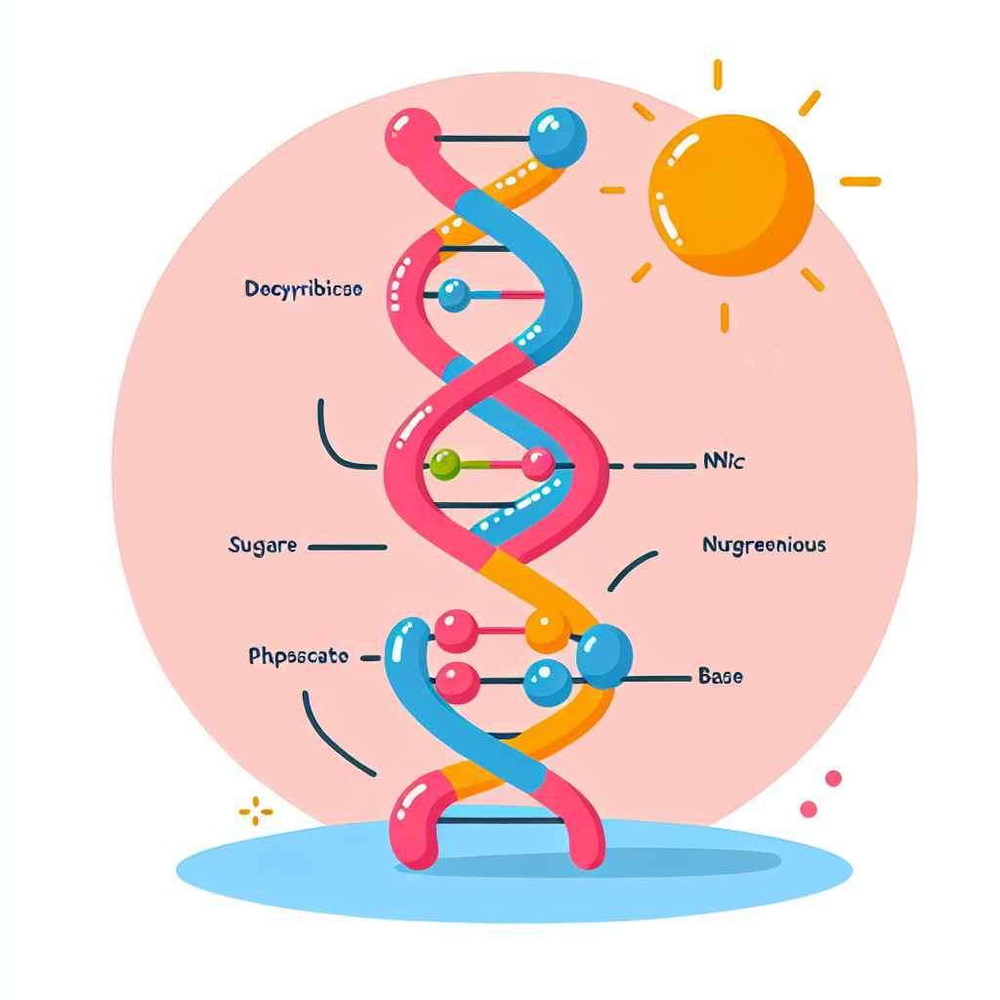

# DNA Nucleotide Count Web App

  

Analyze DNA sequences effortlessly with our DNA Nucleotide Count Web App. Get detailed breakdowns and visualizations of nucleotide composition in just a few clicks!

## Features

- Input your own DNA sequence or use randomly generated examples.
- Calculates and presents the count of each nucleotide (Adenine, Thymine, Guanine, and Cytosine) in the sequence.
- Provides results in various formats including dictionary, textual information, DataFrame, and bar chart.
- User-friendly interface with clear instructions for easy navigation.
- Utilizes Altair for interactive and informative visualizations.
- Responsive design compatible with various devices for seamless usage.
- Offers test input of DNA sequences for users unfamiliar with input format.

## Demo
[Live Demo](https://dna-nucleotide-count-jb.streamlit.app)

## Usage

1. Clone the repository.
2. Install the required dependencies using `pip install -r requirements.txt`.
3. Run the app using `streamlit run dna-app.py`.
4. Input your DNA sequence and explore the results!
